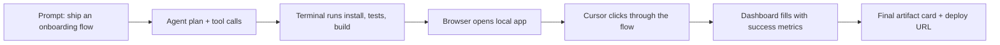

# Showpiece UI Skill

Turn coding agents into demo-scene directors.

Showpiece UI is a repo-local Agent Skill for building polished animated product demos: agent workbenches, terminal-to-browser launches, prompt-to-artifact reveals, cinematic device mockups, workflow canvases, dashboard population, chat choreography, code transformations, knowledge graphs, and other high-end UI storytelling patterns.

## Install

From the root of the project where you want the skill installed:

```bash
npx github:shaiadams10/showpiece-ui-skill
```

Install into a different target directory:

```bash
npx github:shaiadams10/showpiece-ui-skill -- --target /path/to/project
```

This installs:

- `.agents/skills/showpiece-ui` for Codex and Antigravity desktop project-local discovery.
- `.agent/skills/showpiece-ui` for Antigravity CLI project-local discovery.

Fallback installers:

```powershell
powershell -ExecutionPolicy Bypass -Command "irm https://raw.githubusercontent.com/shaiadams10/showpiece-ui-skill/main/scripts/install-from-github.ps1 | iex"
```

```bash
curl -fsSL https://raw.githubusercontent.com/shaiadams10/showpiece-ui-skill/main/scripts/install-from-github.sh | bash
```

## What It Helps Agents Build

| Demo pattern | What it looks like |
| --- | --- |
| AI operating a computer | Cursor moves through a browser, opens menus, fills forms, and completes a task while tool-call cards update. |
| Terminal to live product | Logs stream, tests pass, deploy completes, and a browser or device shell reveals the shipped UI. |
| Prompt to artifact | A prompt becomes a website, report, chart, image grid, slide, or video-ready scene. |
| Workflow canvas | Nodes, arrows, pipes, and status chips show data or agent actions moving through a system. |
| Dashboard populate | Skeletons resolve into metrics, charts, tables, alerts, maps, and live activity. |
| Device theater | MacBook, browser, phone, IDE, or floating screens animate with parallax and cinematic framing. |
| Chat choreography | Messages, typing states, file cards, tool calls, and result previews move in a tight sequence. |
| Code transformation | File tree, diff, tests, and browser preview show one meaningful code change becoming real. |
| Knowledge graph | Documents, citations, entities, and relationships form a clear constellation of evidence. |
| Before/after reveal | Raw input wipes, slides, or morphs into a polished output with proof labels. |

## Example Demo Storyboard



An agent using this skill should turn that into a smooth scene: masked headline reveal, compact chat rail, terminal log stream, browser/device surface, cursor-led interaction, progress cards, and a final proof state.

## Example Prompts

```text
Use $showpiece-ui to create a cinematic hero section for an AI coding agent. Show a terminal turning into a browser preview with smooth tool-call cards.
```

```text
Use $showpiece-ui to design a product demo scene for a healthcare document AI. Show scanned docs becoming structured cards, citations, and a triage dashboard.
```

```text
Use $showpiece-ui to build a Remotion-ready launch video scene for a SaaS analytics tool. Start from skeleton tables and animate into populated charts and alerts.
```

## Inside The Skill

- `SKILL.md`: trigger description and core workflow.
- `references/visual-taxonomy.md`: high-impact animated visual systems.
- `references/visual-language.md`: demo archetypes and storytelling rules.
- `references/component-bank.md`: audited source libraries and when to use them.
- `references/implementation-recipes.md`: React, Tailwind, Motion, and Remotion build patterns.
- `references/source-routes.md`: searchable route snapshot for the audited component sources.

## Credits And Component Sources

This repository does not bundle third-party component source code from the libraries below. It contains an Agent Skill, reference notes, and route/source guidance so an agent can choose the right component source for a project.

When an agent installs or copies components from a source library, follow that library's current license and attribution requirements.

Referenced sources:

- [21st.dev](https://21st.dev/) for community component discovery and Magic UI generation workflows.
- [Aceternity UI](https://ui.aceternity.com/components) for React, Next.js, Tailwind, and Motion component patterns.
- [React Bits](https://reactbits.dev/) for animated React effects, backgrounds, text animations, and interactive components.
- [remocn](https://www.remocn.dev/) for Remotion-ready cinematic UI primitives, transitions, and compositions.

## Develop This Skill

The canonical skill lives at `.agents/skills/showpiece-ui`.

Validate after edits:

```powershell
python "C:/Users/shaib/.codex/skills/.system/skill-creator/scripts/quick_validate.py" ".agents/skills/showpiece-ui"
```

Sync the Antigravity CLI mirror:

```powershell
powershell -ExecutionPolicy Bypass -File scripts/install-local-skill.ps1
```

Package the skill:

```powershell
powershell -ExecutionPolicy Bypass -File scripts/package-skill.ps1
```
