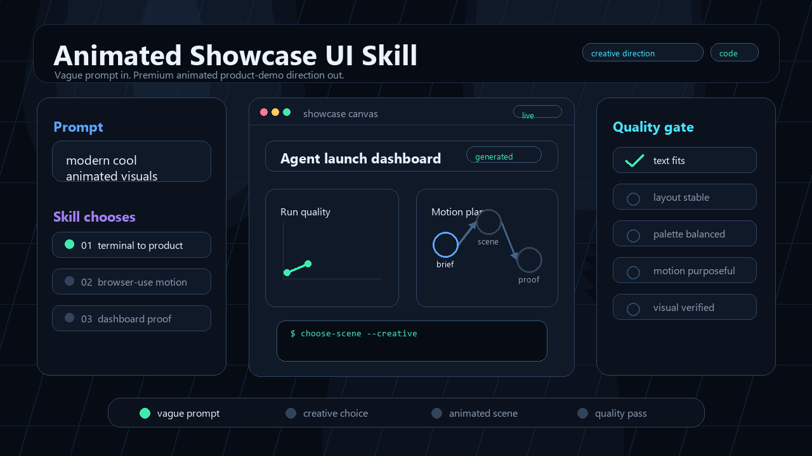

# Animated Showcase UI Skill

Tell your coding agent something vague like:

```text
make this look like a modern cool animated product demo
```

and give it enough visual taste, motion patterns, component sources, and implementation recipes to invent the scene for you.

Animated Showcase UI Skill is a repo-local Agent Skill for generating polished animated showcase interfaces: cinematic landing visuals, agent demos, browser-use scenes, terminal-to-product launches, prompt-to-artifact reveals, device mockups, workflow canvases, chat flows, dashboard population, code transformations, knowledge graphs, and video-ready UI compositions.

## The Big Idea

Most users should not need to know whether they want a MacBook mockup, workflow canvas, masked typography reveal, browser automation scene, animated terminal, Remotion composition, or dashboard-populate sequence.

This skill teaches the agent to make that creative call:

1. Read the product context.
2. Pick the strongest visual metaphor.
3. Choose an animation system.
4. Select useful component sources.
5. Build the animated UI in code.
6. Verify that it actually looks good.

## Install

From the root of the project where you want the skill installed:

```bash
npx github:shaiadams10/animated-showcase-ui-skill
```

Install into a different target directory:

```bash
npx github:shaiadams10/animated-showcase-ui-skill -- --target /path/to/project
```

This installs:

- `.agents/skills/animated-showcase-ui` for Codex and Antigravity desktop project-local discovery.
- `.agent/skills/animated-showcase-ui` for Antigravity CLI project-local discovery.

Fallback installers:

```powershell
powershell -ExecutionPolicy Bypass -Command "irm https://raw.githubusercontent.com/shaiadams10/animated-showcase-ui-skill/main/scripts/install-from-github.ps1 | iex"
```

```bash
curl -fsSL https://raw.githubusercontent.com/shaiadams10/animated-showcase-ui-skill/main/scripts/install-from-github.sh | bash
```

## What It Helps Agents Invent

| Ambiguous request | Strong visual direction the agent can choose |
| --- | --- |
| "make it feel like a modern AI demo" | Chat rail, tool-call cards, cursor-led browser action, artifact preview. |
| "make this landing page more impressive" | Device theater, masked text reveal, parallax product surface, bento proof tiles. |
| "show how the agent ships code" | Terminal stream, file diff, test pass states, browser preview, deploy card. |
| "visualize this automation" | Workflow canvas, moving packets, node activation, progress steps, success proof. |
| "make this dashboard feel alive" | Skeleton-to-data reveal, chart drawing, count-up KPIs, alert rows, activity feed. |
| "create a video-ready product scene" | Remotion-style composition, timed transitions, device zooms, final artifact hold. |
| "make a cool generative AI showcase" | Prompt-to-artifact flow, generation queue, preview grid, before/after reveal. |
| "show knowledge or research visually" | Document cards, citation paths, entity graph, selected evidence panel. |

## Example Prompts

```text
Use $animated-showcase-ui to make this app feel like a premium animated launch demo. Choose the visual direction yourself.
```

```text
Use $animated-showcase-ui to create modern cool animated visuals for this AI agent. I do not know exactly what scene I want, so pick the best one.
```

```text
Use $animated-showcase-ui to build a browser-use product demo with chat, cursor movement, tool calls, and a final dashboard result.
```

## Inside The Skill

- `SKILL.md`: trigger description and core workflow.
- `references/visual-taxonomy.md`: high-impact animated visual systems.
- `references/visual-language.md`: demo archetypes and storytelling rules.
- `references/component-bank.md`: audited source libraries and when to use them.
- `references/implementation-recipes.md`: React, Tailwind, Motion, and Remotion build patterns.
- `references/source-routes.md`: searchable route snapshot for audited component sources.

## Credits And Component Sources

This repository does not bundle third-party component source code from the libraries below. It contains an Agent Skill, reference notes, and route/source guidance so an agent can choose the right component source for a project.

When an agent installs or copies components from a source library, follow that library's current license and attribution requirements.

Referenced sources:

- [21st.dev](https://21st.dev/) for community component discovery and Magic UI generation workflows.
- [Aceternity UI](https://ui.aceternity.com/components) for React, Next.js, Tailwind, and Motion component patterns.
- [React Bits](https://reactbits.dev/) for animated React effects, backgrounds, text animations, and interactive components.
- [remocn](https://www.remocn.dev/) for Remotion-ready cinematic UI primitives, transitions, and compositions.

## Develop This Skill

The canonical skill lives at `.agents/skills/animated-showcase-ui`.

Validate after edits:

```powershell
python "C:/Users/shaib/.codex/skills/.system/skill-creator/scripts/quick_validate.py" ".agents/skills/animated-showcase-ui"
```

Sync the Antigravity CLI mirror:

```powershell
powershell -ExecutionPolicy Bypass -File scripts/install-local-skill.ps1
```

Package the skill:

```powershell
powershell -ExecutionPolicy Bypass -File scripts/package-skill.ps1
```
